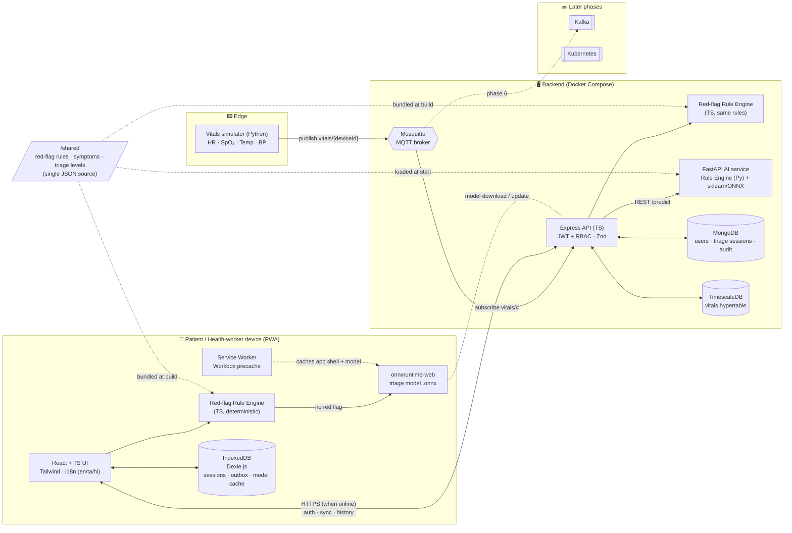
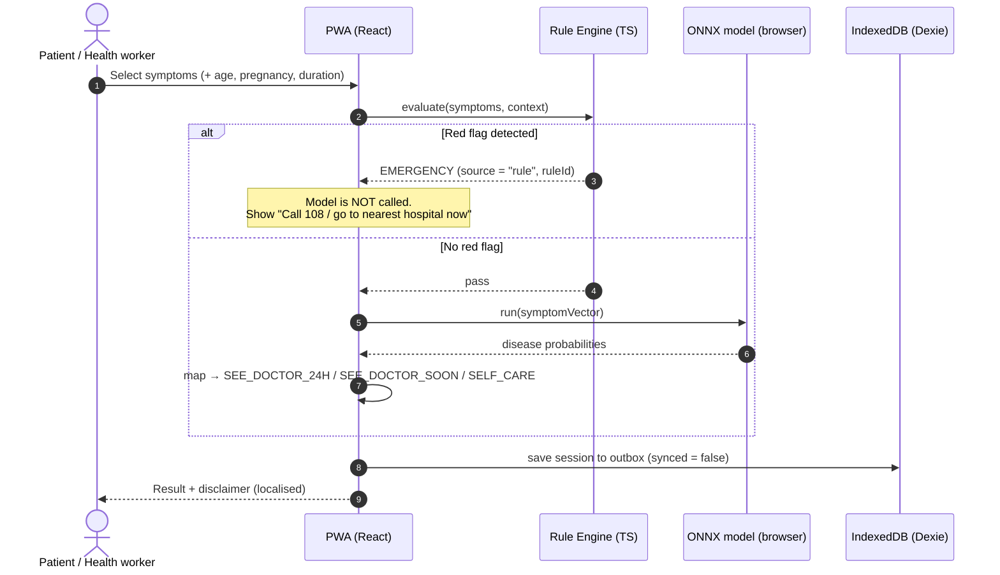
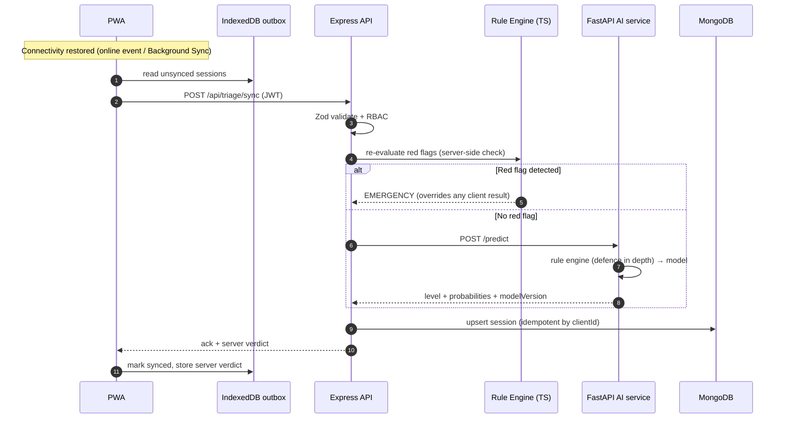
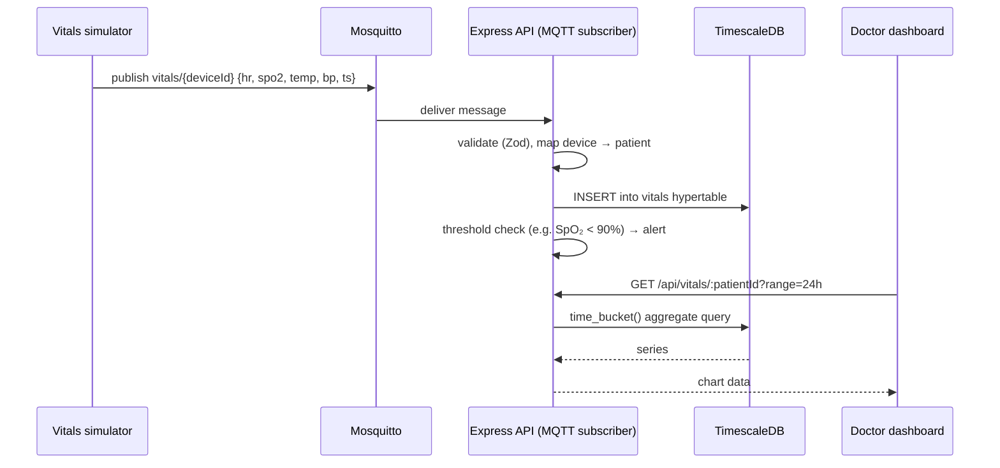

# RuralCare — Architecture

## 1. Component diagram

## 2. Data flows

### 2a. Offline triage path (no connectivity)

### 2b. Online path and background sync

### 2c. Vitals path (edge → time-series)

## 3. Key design decisions

| Decision                                                    | Why                                                                                                                                                                                                                    |
| ----------------------------------------------------------- | ---------------------------------------------------------------------------------------------------------------------------------------------------------------------------------------------------------------------- |
| **Rule engine runs before the model on every path**         | Safety. Red flags must never depend on probabilistic output. The rules run on the client (offline), on the server (re-check on sync), and in the AI service (defence in depth).                                        |
| **Single shared rules file**                                | One JSON definition is consumed by both the TS and Python engines, so the offline and online paths can't drift. Golden test cases run against both engines.                                                            |
| **Structured symptom selection (checklist), not free text** | Works offline, needs no NLP model, translates easily, and maps directly to the model's feature vector.                                                                                                                 |
| **sklearn → ONNX**                                          | The same model file serves the browser (onnxruntime-web) and the server (onnxruntime in FastAPI). It is small enough to precache.                                                                                      |
| **Disease → triage-level mapping table**                    | The model predicts conditions. A curated mapping (reviewed and documented) turns those predictions into one of the four triage levels. Low-confidence predictions escalate to `SEE_DOCTOR_SOON`, never to `SELF_CARE`. |
| **MongoDB for documents, TimescaleDB for vitals**           | Triage sessions are document-shaped. Vitals are high-frequency time-series that benefit from hypertables and `time_bucket` queries.                                                                                    |
| **Idempotent sync keyed by client-generated UUID**          | Offline devices may retry. Duplicate uploads must be safe.                                                                                                                                                             |
| **Server verdict wins**                                     | If the server-side rule check disagrees with the client (e.g. outdated rules on the client), the server result is stored and shown.                                                                                    |

## 4. Triage levels

| Level             | Meaning                                   | Who decides                                            |
| ----------------- | ----------------------------------------- | ------------------------------------------------------ |
| `EMERGENCY`       | Call 108 / go to the nearest hospital now | Rule engine **only**                                   |
| `SEE_DOCTOR_24H`  | See a doctor within 24 hours              | Model + mapping                                        |
| `SEE_DOCTOR_SOON` | Book a visit in the next few days         | Model + mapping (also the fallback for low confidence) |
| `SELF_CARE`       | Home care advice, monitor symptoms        | Model + mapping (high confidence only)                 |

## Delivery phases

| Phase | Scope                                                                                                                                                                    | Status  |
| ----- | ------------------------------------------------------------------------------------------------------------------------------------------------------------------------ | ------- |
| 1     | `/shared` rules, vocabulary and triage levels; TS and Python red-flag engines with shared golden tests; npm workspaces, lint/format, health endpoints, Docker builds, CI | ✅ Done |
| 2     | Backend API: Mongoose models, JWT + RBAC, Zod validation, `POST /triage`, idempotent `POST /triage/sync`, OpenAPI docs                                                   | ⏳      |
| 3     | Kaggle dataset, sklearn training, clean + noisy evaluation, ONNX export, disease → triage mapping, FastAPI `/predict`, `docs/MODEL_REPORT.md`                            | ⏳      |
| 4     | MQTT vitals simulator, server subscriber → TimescaleDB hypertable, threshold alerts, Mosquitto auth                                                                      | ⏳      |
| 5     | Offline-first PWA: Workbox, symptom checklist, in-browser rules + ONNX, Dexie outbox sync, en/ta/hi, dashboards                                                          | ⏳      |
| 6     | Kafka, Kubernetes manifests, security hardening, Playwright E2E (incl. offline), Lighthouse, final report                                                                | ⏳      |
