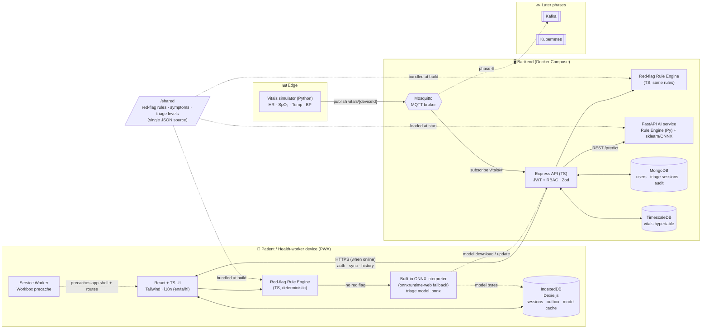
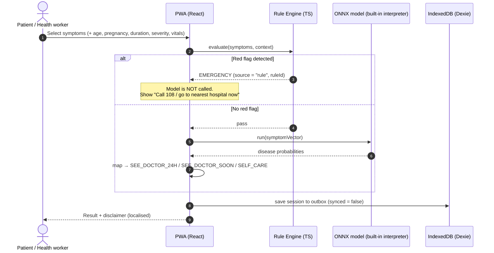
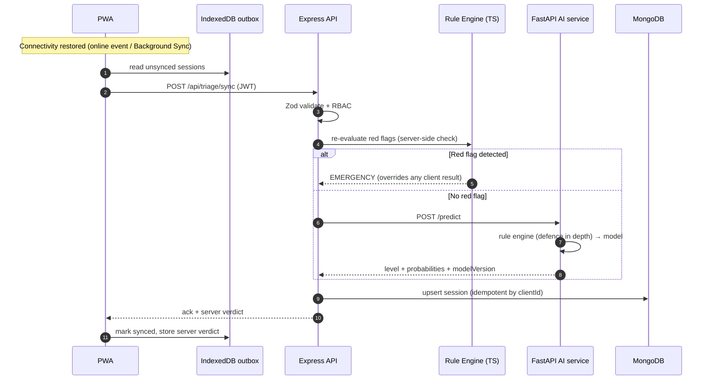
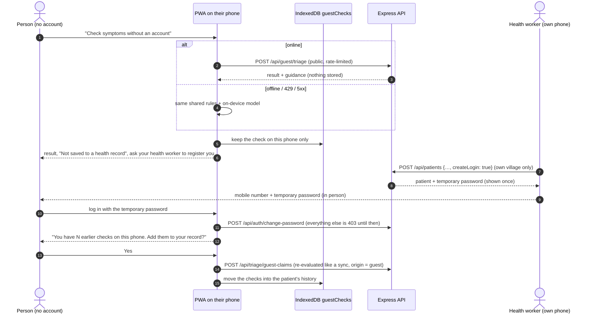

# RuralCare — Architecture

## 1. Component diagram



## 2. Data flows

### 2a. Offline triage path (no connectivity)



### 2b. Online path and background sync



### 2c. Vitals path (edge → time-series → alerts → triage)

```mermaid
sequenceDiagram
    participant SIM as Vitals device (simulator)
    participant MQ as Mosquitto (auth + ACL)
    participant API as Express API (MQTT subscriber)
    participant TS as TimescaleDB
    participant MG as MongoDB
    participant HW as Health worker / doctor

    SIM->>MQ: publish ruralcare/vitals/{patientId}/{deviceId} {ts, heartRate, spo2, temperatureC, systolicBp, diastolicBp} (QoS 1)
    Note over MQ: ACL: a device may only WRITE its own patient's topic;<br/>the server account may only READ
    MQ->>API: deliver message
    API->>API: validate (Zod), check device ↔ patient in MongoDB
    API->>TS: INSERT INTO vitals hypertable (duplicates ignored)
    API->>MG: thresholds (shared/data/vitals.json) → open / update alert
    HW->>API: GET /api/alerts · PATCH /api/alerts/:id (acknowledge)
    HW->>API: GET /api/vitals/:patientId?bucket=1h
    API->>TS: time_bucket() on raw data, or the vitals_hourly continuous aggregate
    HW->>API: POST /api/triage
    API->>TS: most abnormal value per vital in the last 30 min
    API->>API: shared red-flag rules (e.g. SpO₂ < 90 → EMERGENCY)
```

### 2d. Why vitals use TimescaleDB while everything else uses MongoDB

|            | MongoDB (users, patients, triage sessions, alerts)                                                        | TimescaleDB (device vitals)                                                                                                                                                                                                                                             |
| ---------- | --------------------------------------------------------------------------------------------------------- | ----------------------------------------------------------------------------------------------------------------------------------------------------------------------------------------------------------------------------------------------------------------------- |
| Data shape | Documents with nested, evolving fields (a triage session holds input, result, model output, review notes) | One narrow row per reading: time + 5 numbers                                                                                                                                                                                                                            |
| Volume     | Tens of writes per patient per month                                                                      | One reading every 5 s per device: ~17,000 rows per device per day                                                                                                                                                                                                       |
| Queries    | Fetch or update one document; small aggregations for dashboards                                           | "Average SpO₂ per hour for the last week", "worst value in the last 30 min"                                                                                                                                                                                             |
| What helps | Flexible schema, simple idempotent upserts (`clientId`), unique partial indexes (one open alert)          | **Hypertable** (automatic 1-day chunks, so recent queries touch little data), **`time_bucket()`**, a **continuous aggregate** (`vitals_hourly`, refreshed every 30 min, plus real-time rows), and **retention policies** (raw readings 30 days, hourly averages 1 year) |

A document per reading would be slow and large in MongoDB, and these time-series features would have to be built by hand. Conversely, triage sessions don't fit a fixed relational row. Each store does what it is good at. Alerts live in MongoDB because they are low-volume, stateful documents (acknowledged by whom, when, with what note) that sit next to patients and sessions.

## 3. Key design decisions

| Decision                                                    | Why                                                                                                                                                                                                                    |
| ----------------------------------------------------------- | ---------------------------------------------------------------------------------------------------------------------------------------------------------------------------------------------------------------------- |
| **Rule engine runs before the model on every path**         | Safety. Red flags must never depend on probabilistic output. The rules run on the client (offline), on the server (re-check on sync), and in the AI service (defence in depth).                                        |
| **Single shared rules file**                                | One JSON definition is consumed by both the TS and Python engines, so the offline and online paths can't drift. Golden test cases run against both engines.                                                            |
| **Structured symptom selection (checklist), not free text** | Works offline, needs no NLP model, translates easily, and maps directly to the model's feature vector.                                                                                                                 |
| **sklearn → ONNX**                                          | The same model file serves the browser (built-in interpreter, §5) and the server (onnxruntime in FastAPI). It is small enough to store on the device.                                                                  |
| **Disease → triage-level mapping table**                    | The model predicts conditions. A curated mapping (reviewed and documented) turns those predictions into one of the four triage levels. Low-confidence predictions escalate to `SEE_DOCTOR_SOON`, never to `SELF_CARE`. |
| **MongoDB for documents, TimescaleDB for vitals**           | Triage sessions are document-shaped. Vitals are high-frequency time-series that benefit from hypertables and `time_bucket` queries.                                                                                    |
| **Idempotent sync keyed by client-generated UUID**          | Offline devices may retry. Duplicate uploads must be safe.                                                                                                                                                             |
| **Model-unavailable fallback**                              | If the AI service is down or returns anything invalid, the result comes from the rules alone. It is at least `SEE_DOCTOR_SOON`, carries a notice, and is never `SELF_CARE`.                                            |
| **Safety floors**                                           | Data-driven minimum levels (e.g. fever + unknown age ⇒ ≥ `SEE_DOCTOR_24H`) that the model can't go below.                                                                                                              |
| **Built-in ONNX interpreter in the browser**                | onnxruntime-web's WebAssembly runtime is 3.7 MB gzipped; the model is 27 KB. A tiny interpreter runs the same file, tested to 1e-5 parity. onnxruntime-web is the automatic fallback. See §5.                          |
| **Server verdict wins**                                     | If the server-side rule check disagrees with the client (e.g. outdated rules on the client), the server result is stored and shown.                                                                                    |
| **No self sign-up; accounts come from a known person**      | A health worker registers patients in their own villages; only an admin creates staff and sets roles. Fake accounts can't appear, and every patient belongs to a village with a responsible health worker.             |
| **Guest triage stores nothing on the server**               | People can check symptoms before they are registered, with the same safety rules, but no health data is kept about someone who has not agreed to a record.                                                             |
| **Temporary passwords must be changed**                     | The person who set a temporary password (health worker or admin) must not know the user's real password.                                                                                                               |

## 4. Triage levels

| Level             | Meaning                                   | Who decides                                            |
| ----------------- | ----------------------------------------- | ------------------------------------------------------ |
| `EMERGENCY`       | Call 108 / go to the nearest hospital now | Rule engine **only**                                   |
| `SEE_DOCTOR_24H`  | See a doctor within 24 hours              | Model + mapping                                        |
| `SEE_DOCTOR_SOON` | Book a visit in the next few days         | Model + mapping (also the fallback for low confidence) |
| `SELF_CARE`       | Home care advice, monitor symptoms        | Model + mapping (high confidence only)                 |

## 5. In-browser model runtime (decision)

**Decision:** offline predictions run on a small built-in ONNX interpreter ([`client/src/model/onnxLite.ts`](../client/src/model/onnxLite.ts)). onnxruntime-web is kept only as an **automatic fallback**. This deviates from the original stack plan (onnxruntime-web as the browser runtime) and was approved for Phase 5.

**Why.** The triage model is a 27 KB logistic regression. onnxruntime-web's smallest WebAssembly build is 14.2 MB, **3.7 MB gzipped**: about 140 times the size of the model it would run. RuralCare targets phones on slow, metered rural connections, where that download takes minutes, costs the user data, and would dominate the offline precache (the whole app shell is ~620 KB raw). The interpreter adds a few KB, reads the **same `.onnx` file** the server uses, and so keeps one model artefact and one source of truth.

**How the fallback works.** The interpreter supports exactly the operators this model needs (`LinearClassifier`, `Normalizer`). Any other operator throws `UnsupportedModelError`; `createPredictor()` ([`modelManager.ts`](../client/src/model/modelManager.ts)) catches it and lazily imports the CPU-only `onnxruntime-web/wasm` build. A future model type (e.g. a tree ensemble) therefore works without code changes. onnxruntime-web is not precached and is downloaded only if that happens.

**How parity is tested** (in `npm test` and CI, against the exact file the PWA serves):

- `client/src/model/onnxLite.test.ts`: interpreter vs scikit-learn `predict_proba` on 112 fixtures exported with the model (`ai-service/models/parity_fixtures.json`), and interpreter vs **onnxruntime-node** (the same ONNX Runtime kernels as onnxruntime-web) on the same batch. Both must agree within **1e-5**. It also checks that rows sum to 1 and that an unsupported file triggers the fallback error.
- `client/src/model.parity.test.ts`: the served file's sha256 matches its metadata and fixtures; onnxruntime-node reproduces scikit-learn within 1e-5 using the shared `buildFeatureVector()`.
- `ai-service` pytest: scikit-learn ↔ onnxruntime (Python) on the same fixtures.

Limitation: the onnxruntime-web fallback is not run in a real browser in CI, because the current model never needs it. Its correctness rests on sharing kernels with onnxruntime-node, which is tested.

## 6. Client architecture (Phase 5)

Full details: [PWA.md](PWA.md).

| Layer        | What                                                                                                                                           |
| ------------ | ---------------------------------------------------------------------------------------------------------------------------------------------- |
| Shell        | React 19 + React Router, Tailwind, en/ta/hi. Route-level code splitting; Recharts loaded lazily for dashboards only.                           |
| Offline      | Workbox service worker (vite-plugin-pwa) precaches the shell and every route. Dexie (IndexedDB): sessions + outbox, patient cache, model.      |
| Triage       | Wizard → `submitTriage()`: server when online; otherwise shared `decideTriage()` + built-in model on the device, queued for sync.              |
| Sync         | Outbox → `POST /api/triage/sync` (idempotent by client UUID), backoff 5 s → 5 min; a "server result differs" message when the verdict changes. |
| Model update | `GET /api/model/version`; download only when the sha256 changes, verify sha256, check it loads, then replace.                                  |
| Dashboards   | Health worker (patients, triages, alerts), doctor (review queue, emergencies first), patient (vitals charts), admin (stats). Online only.      |

## 7. Onboarding and accounts

New users start without an account, and accounts are created only by people they already know: their village health worker (patients) or an admin (staff). Safety rules: [SAFETY.md §6](SAFETY.md#6-onboarding-guest-triage-and-accounts). API: [API.md](API.md#onboarding-and-accounts).



| Piece                         | Where                                                                                                                                                        |
| ----------------------------- | ------------------------------------------------------------------------------------------------------------------------------------------------------------ |
| Guest triage                  | `server/src/routes/guest.ts` (calls the same `evaluateTriage()`), `client/src/triage/guest.ts`, the wizard with `guest`, `GuestLayout`, `GuestResultPage`    |
| Guest checks on the phone     | Dexie v2 adds a `guestChecks` table (existing data untouched). It is not the sync outbox, so the sync engine never sends it.                                 |
| Claiming guest checks         | `POST /api/triage/guest-claims` reuses the sync code path (`syncOne`) with `origin: "guest"`; `GuestClaimPrompt` in the patient layout                       |
| Registration by health worker | `POST /api/patients` with `createLogin`; `RegisterPatientPage`; reset from the patient page                                                                  |
| Admin                         | `/api/users` (create without password ⇒ temporary password, reset), `PATCH /api/villages/:id`; `AdminUsersPage`                                              |
| Temporary passwords           | `User.mustChangePassword`; `authenticate()` refuses everything except change-password, `/me` and logout; the PWA redirects to `/change-password`             |
| Forgot password               | `POST /api/auth/password-reset/request` and `/confirm`; `PasswordReset` collection (HMAC of the code, TTL index); `SmsSender` interface (console mock today) |
| Rate limits                   | `server/src/lib/rateLimit.ts`, in memory per process (fixed window per IP); the per-phone OTP limit is counted in MongoDB                                    |

**Compatibility.** Existing users have no `mustChangePassword` field and are treated as `false`, so no migration and no data reset are needed. All response changes are additions (`mustChangePassword`, `login`, `temporaryPassword`). The only removed behaviour is public self-registration, which the app never used.

## Delivery phases

Model evaluation and limitations: [MODEL_REPORT.md](MODEL_REPORT.md). Safety decisions and the Phase 5 form requirements (age required, pregnancy question) are in [SAFETY.md](SAFETY.md). The PWA's offline design is in [PWA.md](PWA.md).

| Phase | Scope                                                                                                                                                                                                                                                                                                                                                       | Status  |
| ----- | ----------------------------------------------------------------------------------------------------------------------------------------------------------------------------------------------------------------------------------------------------------------------------------------------------------------------------------------------------------- | ------- |
| 1     | `/shared` rules, vocabulary and triage levels; TS and Python red-flag engines with shared golden tests; npm workspaces, lint/format, health endpoints, Docker builds, CI                                                                                                                                                                                    | ✅ Done |
| 2     | Backend API: Mongoose models, JWT + RBAC, Zod validation, triage with rules-only fallback, idempotent sync, doctor review, dashboard stats, Swagger UI, seed data, safety floors                                                                                                                                                                            | ✅ Done |
| 3     | Kaggle dataset (verified, not committed), dedup + 5-fold CV, clean + noisy evaluation, 3 models compared, tuned logistic regression → 27 KB ONNX, parity sklearn ↔ onnxruntime ↔ onnxruntime-node, conditions + advice in /shared, `/predict`, `/model/version`, real-model seed data                                                                       | ✅ Done |
| 4     | Mosquitto with passwords + per-device ACL, Python vitals simulator with on-demand abnormal readings, MQTT → TimescaleDB hypertable + hourly continuous aggregate + retention, threshold alerts with acknowledgement, vitals in triage (critical vitals → EMERGENCY via shared rules), vitals/alerts APIs                                                    | ✅ Done |
| 5     | Offline-first PWA: Workbox precache, triage wizard (icons, search, voice), in-browser shared rules + built-in ONNX interpreter (onnxruntime-web fallback), Dexie outbox sync with backoff, en/ta/hi, role dashboards, worse-of device/manual vitals, age-aware alert thresholds, duration/severity floors, Playwright e2e (incl. offline) in CI, Lighthouse | ✅ Done |
| 5b    | Onboarding: guest triage (online and offline, nothing stored), health-worker patient registration with temporary passwords, admin user and village management, forgot password with SMS code (mocked), guest checks added to a record                                                                                                                       | ✅ Done |
| 6     | Kafka, Kubernetes manifests, security hardening, final report                                                                                                                                                                                                                                                                                               | ⏳      |
