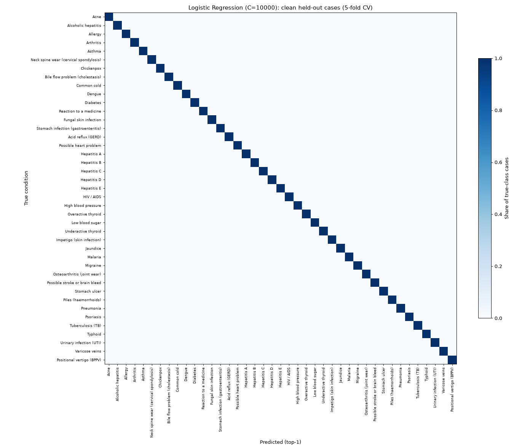
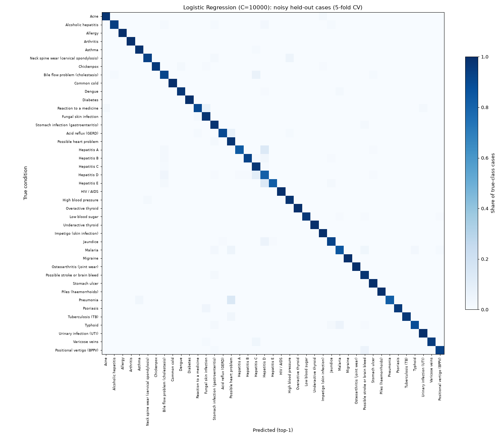

# RuralCare triage model report

> Generated by `python -m training.train` on 2026-10-04 18:27 UTC. Don't edit by hand; re-run the script.
>
> ⚠️ **This model is not a diagnosis tool and is not clinically validated.** It suggests *possible* conditions to support triage. Red-flag symptoms are handled by deterministic rules before the model runs (see [SAFETY.md](SAFETY.md)).

## 1. Summary

| | |
|---|---|
| Chosen model | **Logistic Regression (C=10000)** (`lr-20261004-ab911d5e`) |
| Chosen because | best top-1 accuracy on the **noisy** test set: 94.6 ± 0.6% |
| Noisy top-3 accuracy | 99.8 ± 0.2% |
| Clean top-1 accuracy | 100.0 ± 0.0% |
| Under-triage on noisy cases (end-to-end) | 0.6% |
| ONNX file size | **26.9 KB** (target < 2 MB) |
| sklearn vs onnxruntime max difference | 3.6e-07 |

## 2. Dataset

[Disease Symptom Prediction](https://www.kaggle.com/datasets/itachi9604/disease-symptom-description-dataset) by Pranay Patil (Kaggle `itachi9604/disease-symptom-description-dataset`, version 2), licensed **CC BY-SA 4.0**. The raw CSVs are not committed. `python -m training.fetch_dataset` downloads them and `python -m training.check_dataset` verifies them:

| File | sha256 | Columns |
|---|---|---|
| `dataset.csv` | `ebbd391c4ba4d64f…` | 18 |
| `Symptom-severity.csv` | `cb5a84b5ebde81bb…` | 2 |
| `symptom_Description.csv` | `e0581662e8155095…` | 2 |
| `symptom_precaution.csv` | `49371294708232b9…` | 5 |

- 4920 rows = 41 diseases × 120 rows, 131 distinct symptoms (names cleaned, e.g. `dischromic _patches` → `dischromic_patches`).
- **Only 304 rows are unique.** Each (disease, symptom set) pair is repeated about 16 times. Unique cases per disease: 5 to 10.
- No symptom set appears under two different diseases, so the data is perfectly separable: it is near-synthetic.

## 3. Why the usual evaluation is misleading

With the common random 80/20 split over all 4920 rows, **100.0% of test rows also appear, word for word, in the training set**. The models are just recognising rows they have seen:

| Model | Top-1 accuracy with the leaky split |
|---|---|
| Logistic Regression (C=10000) | 100.0% |
| Random Forest (100 trees) | 100.0% |
| Bernoulli Naive Bayes | 100.0% |

So every number below uses only the **304 unique cases**, with stratified 5-fold cross-validation. No test case is ever seen in training.

## 4. Evaluation protocol

- **Clean test set:** the held-out fold, exactly as in the dataset.
- **Noisy test set:** 10 copies of every held-out case. Each copy drops 30–50% of the symptoms (keeping at least one) and adds 1–2 unrelated symptoms, meaning ones never seen with that disease. This simulates patients who describe symptoms incompletely and mention unrelated complaints. Red-flag symptoms are never *added*, because they trigger EMERGENCY before the model runs. Random seed 42; every model sees the same noisy cases.
- **End-to-end triage (noisy set):** each noisy case goes through the production path: red-flag rules, then the model, then the prediction policy (adult patient, age 30 years). The expected level is the curated level of the true condition (`shared/data/conditions.json`). **Under-triage** means a less urgent level than expected; this is the safety-critical error.

## 5. Results (mean ± std over 5 folds, %)

| Model | Clean top-1 | Clean top-3 | Clean macro-F1 | **Noisy top-1** | Noisy top-3 | Noisy macro-F1 |
|---|---|---|---|---|---|---|
| **Logistic Regression (C=10000)** | 100.0 ± 0.0 | 100.0 ± 0.0 | 100.0 ± 0.0 | **94.6 ± 0.6** | 99.8 ± 0.2 | 94.7 ± 0.5 |
| Random Forest (100 trees) | 100.0 ± 0.0 | 100.0 ± 0.0 | 100.0 ± 0.0 | 89.1 ± 1.1 | 98.9 ± 0.3 | 88.4 ± 1.2 |
| Bernoulli Naive Bayes | 97.7 ± 2.0 | 100.0 ± 0.0 | 96.6 ± 3.1 | 84.2 ± 2.4 | 96.3 ± 1.5 | 80.5 ± 3.5 |

End-to-end triage on the noisy set, plus the export size:

| Model | Noisy log-loss | Noisy calibration error (ECE) | Exact level | **Under-triage** | Over-triage | Sent to EMERGENCY by rules | ONNX size |
|---|---|---|---|---|---|---|---|
| Logistic Regression (C=10000) | 0.237 | 0.078 | 81.1% | **0.6%** | 18.3% | 17.0% | 26.9 KB |
| Random Forest (100 trees) | 1.048 | 0.504 | 73.8% | **2.3%** | 23.9% | 17.0% | 3510.0 KB |
| Bernoulli Naive Bayes | 0.466 | 0.039 | 73.6% | **1.9%** | 24.5% | 17.0% | 23.3 KB |

## 6. Model choice

**Logistic Regression (C=10000)** has the best top-1 accuracy on the noisy set (94.6 ± 0.6% vs 89.1 ± 1.1% for Random Forest (100 trees)). Noisy input is closest to how real patients describe symptoms, so it is the selection criterion; clean accuracy is near-perfect for every model and cannot separate them. Ties would be broken by lower under-triage, then smaller file size.

Logistic regression adds up evidence from each symptom independently, so when some symptoms are missing the remaining ones still point the right way and the probabilities shrink gracefully instead of collapsing. It is also among the smallest and fastest models to run in the browser. With the tuned C (below) it also has the lowest noisy log-loss of the three. Naive Bayes has a slightly lower calibration error but is about 10 points less accurate, and good probabilities matter because the low-confidence rule relies on them.

### Tuning logistic regression's regularisation (C)

With scikit-learn's default C = 1, accuracy was already the best of the three, but the probabilities were heavily *under*-confident. Only about 1-2% of noisy predictions reached the 0.6 confidence threshold, even though about 95% of the 'unsure' ones were correct. The low-confidence rule then fired almost every time and SELF_CARE was practically never given. C changes calibration much more than accuracy, so it is chosen by **noisy log-loss**, a proper scoring rule that rewards accurate *and* calibrated probabilities:

| C | Noisy top-1 | Noisy log-loss | Calibration error (ECE) | Predictions >= 0.6 confidence |
|---|---|---|---|---|
| 1 | 95.1% | 1.281 | 0.647 | 1.5% |
| 10 | 94.6% | 0.705 | 0.401 | 38.7% |
| 100 | 94.6% | 0.389 | 0.204 | 78.1% |
| 1000 | 94.7% | 0.249 | 0.093 | 91.0% |
| **10000** | 94.6% | **0.236** | 0.078 | 91.8% |

Note: C is chosen on the same cross-validation folds that are reported, so logistic regression's calibration numbers are slightly optimistic. Accuracy is almost flat across C, so the model comparison itself is not affected. The gain levels off above C = 1000. Such weak regularisation suits this perfectly separable data, but it is also a warning: on real patients, who don't look like the dataset, the model may be over-confident. This is why its output never decides EMERGENCY and why unknown symptoms block SELF_CARE.

## 7. Low-confidence rule

Policy (`shared/data/conditions.json`): below a top-1 probability of **0.6** the result is never SELF_CARE. A runner-up in the top 3 with probability ≥ 0.25 can raise the level, and any symptom the model has no feature for also blocks SELF_CARE.

On the noisy set with Logistic Regression (C=10000):

- 91.8% of predictions are confident (≥ 0.6).
- Top-1 accuracy when confident: 96.9%.
- Top-1 accuracy when not confident: 68.5%.
- SELF_CARE given while confidence was low: 0.0% (must be 0).

## 8. Confusion matrices

Rows are true conditions and columns are top-1 predictions, normalised per row. Out-of-fold predictions:





Most frequent confusions on the noisy set:

| True condition | Predicted as | Cases | Share of that condition |
|---|---|---|---|
| Pneumonia | Possible heart problem | 13 | 14.4% |
| Hepatitis E | Hepatitis D | 12 | 13.3% |
| Hepatitis A | Hepatitis D | 12 | 13.3% |
| Hepatitis D | Hepatitis C | 10 | 10.0% |
| Typhoid | Malaria | 5 | 5.6% |
| Jaundice | Hepatitis D | 5 | 5.6% |
| Acid reflux (GERD) | Possible heart problem | 5 | 7.1% |
| Bile flow problem (cholestasis) | Hepatitis C | 5 | 6.2% |
| Positional vertigo (BPPV) | Possible stroke or brain bleed | 4 | 5.7% |
| Malaria | Possible heart problem | 4 | 5.0% |
| Hepatitis D | Bile flow problem (cholestasis) | 4 | 4.0% |
| Reaction to a medicine | Fungal skin infection | 4 | 6.7% |

## 9. Triage-level confusion (noisy set, end-to-end)

| Expected \ Told | EMERGENCY | SEE_DOCTOR_24H | SEE_DOCTOR_SOON | SELF_CARE |
|---|---|---|---|---|
| SEE_DOCTOR_24H | 389 | 863 | 15 | 3 |
| SEE_DOCTOR_SOON | 67 | 33 | 1430 | 0 |
| SELF_CARE | 60 | 5 | 2 | 173 |

Cells to the right of the diagonal are under-triage. Cells in the EMERGENCY column are cases whose remaining true symptoms include a red flag (for example, chest pain for a heart attack, breathlessness for asthma or pneumonia). That over-triage is deliberate (see SAFETY.md §3.1).

## 10. ONNX export and parity

- `ai-service/models/triage_model.onnx`: 27591 bytes, opset 15, input `symptoms` float32 [N, 131], output `probabilities` float32 [N, 41]. The input order is `features` and the output order is `classes` in `model_metadata.json`.
- The same two files are copied to `client/public/models/` for the PWA. A test checks that the copies match.
- **Parity:** sklearn vs Python onnxruntime on all training cases: max |Δp| = 3.6e-07. `ai-service/models/parity_fixtures.json` stores sklearn outputs for 112 inputs (clean, noisy, empty, single symptoms). These are replayed by `ai-service/tests/test_model.py` (onnxruntime) and `client/src/model.parity.test.ts` (onnxruntime-node, the same engine family as onnxruntime-web in the browser).

## 11. Limitations

- **Near-synthetic data.** There are 304 unique symptom combinations, each repeated many times. They are perfectly separable and generated from a disease-to-symptom table, not real patient records. Real-world accuracy will be lower than anything reported here.
- **Not clinically validated.** Neither the model, the condition list nor the condition-to-triage mapping has been reviewed by clinicians or tested prospectively.
- **Not a diagnosis tool.** The output lists *possible* conditions to guide triage. Every result carries a disclaimer.
- **Narrow scope.** Only 41 conditions are covered. The model has no input for age, sex, duration, severity or vital signs, and a condition outside this list will be mislabelled as the nearest one.
- **The model never decides emergencies.** Conditions such as heart attack or brain haemorrhage map to SEE_DOCTOR_24H at most. EMERGENCY comes only from the red-flag rules. Cases routed to EMERGENCY by breathlessness are deliberate over-triage.
- **Simple noise model.** Random dropping and adding is only a rough stand-in for how people really report symptoms. It is a stress test, not a field estimate.

## 12. Reproduce

```bash
cd ai-service
pip install -r requirements-dev.txt
python -m training.fetch_dataset   # or download manually into ai-service/data/raw/
python -m training.check_dataset
python -m training.train           # writes models/, client/public/models/, this report
```
